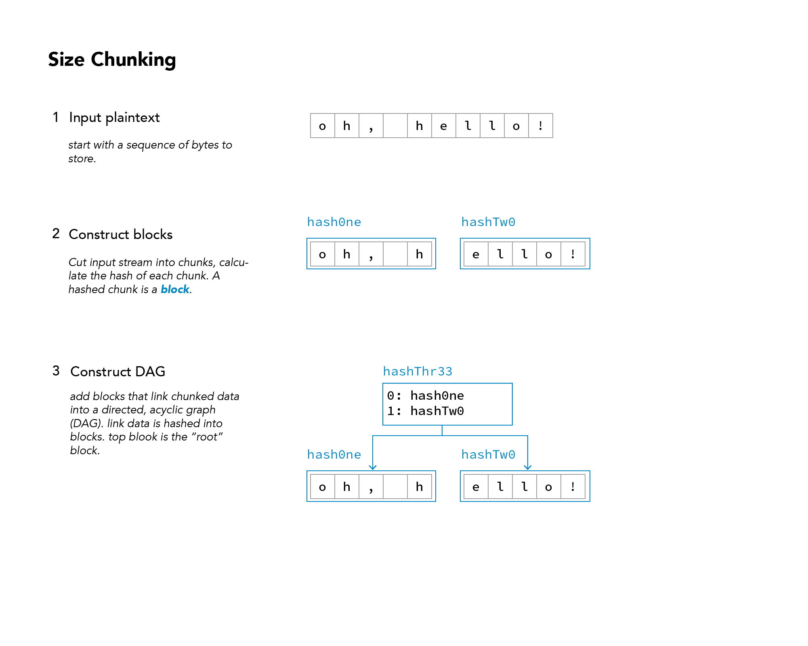
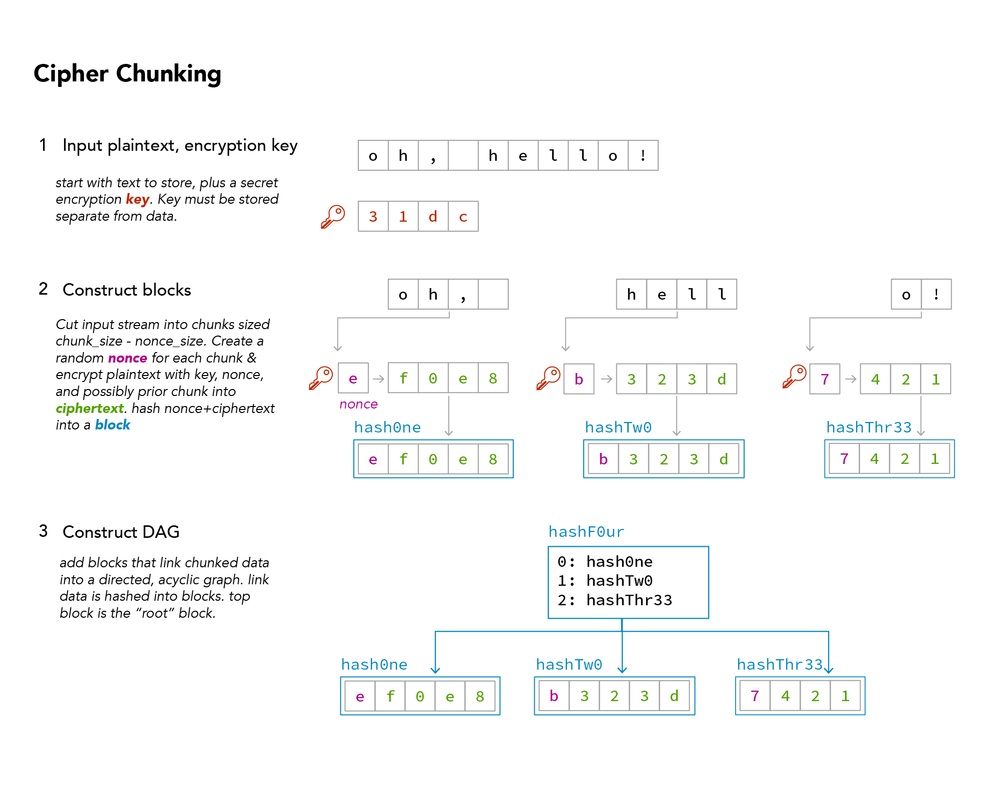

# Storing Encrypted Data on IPFS

How do we do encryption efficently on IPFS, a block-based merkelized file system?

## 01. Chunking in IPFS

IPFS stores data in merkle trees: directed acyclic graphs that refer to content by hash-of-content. Turning an aribitrary byte sequence into a merkle tree requires breaking up the input sequence into subsequences that can be hashed and arranged into a tree. The process of breaking the input sequence into subsequences is called _chunking_:

The above is an example of _size_ chunking, a _chunking strategy_ that divides the sequence into fixed-size blocks. Size chunking is the default chunking strategy in IPFS, defaulting to 262,144 byte blocks (1024 * 256). Blocks within IPFS are capped at 1Mib of payload data (see [discussion]( https://github.com/ipfs/go-ipfs-chunker/pull/21#discussion_r369124879)).

There are other chunking strategies like [rabin fingerprinting](https://github.com/ipfs/go-ipfs-chunker/blob/master/rabin.go) and [buzzhash](https://github.com/ipfs/go-ipfs-chunker/blob/master/buzhash.go), which have the advantage of increasing block overlap by looking for "patterns" in the input stream and aligning chunk boundaries. Strategies for deduplicated encrypted block data is impractical, for reasons we'll get into below.

## 02. Encryption Ciphers

By "encryption" we really mean _Authenticated Encryption with Associated Data (AEAD)_. A form of encryption which simultaneously assures the confidentiality and authenticity of data. Encryption algorithms are known as _ciphers_.

Encryption comes in _streaming_ and _block_ flavours. Block modes break an input stream into blocks and encrypt each block with a distinct nonce, and often use state from the prior block to harden secrecy. In contrast, streaming encryption works byte-by-byte. While we do want streams, data in IPFS is persisted in blocks, then reconstructed into a byte stream during retrieval.

There are numerous cipher algorithms in use today, all with a number of characteristics. For practical purposes it's worth zeroing in on two cipher/mode combinations: `AES-GCM` and `ChaCha20-Poly1305`:

#### AES-GCM
The [Advanced Encryption Standard](https://en.wikipedia.org/wiki/Advanced_Encryption_Standard) running in [Galois-Counter Mode](https://en.wikipedia.org/wiki/Galois/Counter_Mode). AES benefits from hardware accelleration on numbers chip architectures. When operating in GCM can be parallelized on both encryption and decryption:

| Galois/counter (GCM)      |     |
|---------------------------|-----|
| Encryption parallelizable | Yes |
| Decryption parallelizable | Yes |
| Random read access        | Yes |

#### ChaCha20-Poly1305
> There are no secure encryption algorithms optimized for mobile browsers and APIs in TLS right now—these new ciphers fill that gap.
[cloudflare blog post](https://blog.cloudflare.com/do-the-chacha-better-mobile-performance-with-cryptography/)

> Poly1305 is a cryptographic message authentication code (MAC) created by Daniel J. Bernstein. It can be used to verify the data integrity and the authenticity of a message. A variant of Bernstein's Poly1305 that does not require AES has been standardized by the Internet Engineering Task Force in RFC 8439.
[wikipedia](https://en.wikipedia.org/wiki/Poly1305)

ChaCha20-Poly1305 used today in TLS, and provides solid performance in pure software. This makes it a good choice on mobile devices, which generally lack low level instructions for hardware-accellerated AES.

## 03. Cipherchunking

_cipherchunking_ is a modified size-chunking strategy that passes chunked data through an encryption step before hashing into blocks.

We construct a chunker that wraps a _cipher_ built from a single _symmetric key_ (usually a random number 32 bytes in length). The key must be kept secret, and stored separately from the data. Each chunk gets a crypto-grade-random _initialization vector (IV)_ when it's constructed. The IV is often refered to as a _nonce_. Nonces are not secret, but must be retained and combined with the key to decrypt the ciphertext.

By convention the nonce is prepended to the first bytes of the block ciphertext. This is a common convention used when storing block-encrypted data because the nonce is required before decryption can begin. The Go language `crypto/cipher` standard libary package prepends nonces to ciphertext by default. Ciphers use a nonce size that is based on the length of the key, making the process of separating nonce from ciphertext trivial.

Cipherchunking has a few notable properties:
* The DAG structure is _not_ encrypted, only the byte sequence is.
  * This is a _small_ compromise in secrecy. Encrypted data is normally stored in an ordered sequence, where the block size is itself a secret
    * In this case an attacker knows that each block begins with a nonce.
  * All existing IPFS code will interpret cipherchunked as a valid UnixFS file, the data will be illegible without the key.
  * IPFS UnixFS files support `Seek`ing to byte offsets by skipping through the dag. cipherchunked files inherit this property.
  * Security _could_ be added by randomizing & encoding special instructions for walking the DAG. It's not clear this would provide much benefit.
* Cipherchunking DAG-layout independant. Balanced & Trickle DAG structures can be constructed using existing dag layout construction code.
* Hashing the same content multiple times will produce different hashes, because nonces are randomly generated and stored within blocks. This is required for keeping encrypted data secure, regardless of how encrypted data is stored.
  * Because of this **encrypted data stored on IPFS will never "self-deduplicate" through hash collision the way plaintext does.**
* Cipherchunking does not support UnixFS Directories. Directories must be defined in plaintext.
* Cipherchunked files _can_ be stored within existing plaintext directories
* cipherchunking can be used equally with both block and streaming ciphers. Cipherchunking aligns byte length to IPFS chunk size

#### Performance
When writing to IPFS data _must_ be chunked. If we want to write encrypted data to IPFS, it _must_ be encrypted, cipherchunking combines these two processes into the same step, decreasing the overall amount of memory allocations required when compared to encrypting data before chunking by re-using memory allocations already required by the chunker for encryption.

Combining these steps drives optimizations in either chunking or encryption into the other. A parallelized DAG constructor when combined with a cipherchunker will yeild parallelized encryption, **even if the chosen cipher doesn't support parallelized encryption**.

## 04. Cipherfile
Decrypting the data requires a _cipherfile_, a file that walks the DAG structure, using the same cipher to _decrypt_ each block as it's read.

## 05. Security Concerns
Using the ciphers outlined here, It's important to **never use more than 2^32 random nonces with a given key** because of the risk of a repeat. For this reason, we shouldn't ever encrypt a DAG that's larger than ~4.2M blocks or 7.62939453125PiB if written as a single file. So... we don't support encrypted 7PiB files, or 7PiB worth of block data.

But this 2^32 limit, **Keys should not be shared across files.** Keys are relatively cheap to generate. **Any system designed around symmectric key encruption should aim to construct and store one symmetric key per file, or a similar level of granularity**.

IPFS isn't designed to store, share, or create symmetric keys. [Diffie-Hellman Key Exchange](https://en.wikipedia.org/wiki/Diffie–Hellman_key_exchange) is used in TLS for symmetric key exchange.

#### Cipher Normalization
We _could_ handle cipher suite selection by adding [Multicodecs](https://github.com/multiformats/multicodec) for various cipher suites:

| cipher    | mode      | proposed name | proposed tag  | proposed code | note |
|-----------|-----------|---------------|---------------|---------------|------|
| AES       | GCM       | aes-gcm       | aead          | ???           | security level (128/192/256bit) is key-dependant, not speficied in codec. |
| ChaCha20  | Poly1305  | aes-gcm       | aead          | ???           |      |

We shouldn't do this. Given that cipherchunked data is generally easier for an attacker to acquire when stored on IPFS, and the protocol-level information leak of knowing that each block begins with a nonce, **the chosen cipher should be obfuscated**. This does **not** provide additional security, but added _secrecy_ can't hurt in this context. Cipher selection should be normalized out-of-band ideally utilizing techniques outlined in [JSON Web Encryption (JOSE)](https://datatracker.ietf.org/doc/rfc7516/?include_text=1) and it's Web3 counterpart [DAG-JOSE](https://github.com/ipld/specs/blob/master/block-layer/codecs/dag-jose.md). 

In the event that a cipher is compromised, any attacker with access to block data and knowledge that the compromised cipher was used would be able to decrypt the contents.

## 07. Future research

#### Novel Encryption Ciphers designed for use on merklized data structures.
IPFS is already providing the "authentication" aspect of "confidentiality and authtenticity" through merklization. This means cipherchunking using existing encryption algorithms is calculating a hash twice per block, once within the cipher, and again on the `nonce + cipher` binary data. It may be possible to construct a cipher that relies on content addressing for authenticity, and only provides confidentiality.

#### Version Control
When working with plaintext, IPFS is a natural compliment to snapshot-based version control because blocks deduplicate across versions, saving disk space. Because encryption requires nonces within blocks, 2 versions of the same file will almost certianly require the same amount of disk space to store both versions of the same file separately. 

#### Non-UnixFS DAGs
Cipher normalization would require encoding data with a different CID multicodec prefix, which would break rendering on IPFS gateways, but we may be able to pick up (small) performance and storage gains by designing a 

## 08. Background

#### Related Formats
[DAG-JOSE](https://github.com/ipld/specs/blob/master/block-layer/codecs/dag-jose.md) interprets the [JSON Web Encryption](https://datatracker.ietf.org/doc/rfc7516/?include_text=1) IETF specification into IPLD. JOSE is a standard for signing and encrypting JSON objects. Cipherchunking is aimed at encrypting arbitrary amounts of _binary_ data. With that said, **both specifications must contend with cipher normalization**, and would benefit from coordination here.

#### Libraries
* [encrypted-stream](https://github.com/nknorg/encrypted-stream) does a number of streaming cipher suites over a `net.Conn`

#### Useful links
* https://en.wikipedia.org/wiki/Block_cipher_mode_of_operation
* https://blog.cloudflare.com/do-the-chacha-better-mobile-performance-with-cryptography/

## 09. Alternative ciphers and modes
While researching cipherchunking a number of different ciphers have been considered:

## Changelog

* **2021-08-27**
  * moved ChaCha-Poly1305 back into the list of usable algos. @expede has pointed out there's little downside to using a streaming cipher on a block-sized amount of bytes
  * recommend _against_ normalizing ciphers with multicodecs, added explination about why it's a bad idea
  * added a section on performance